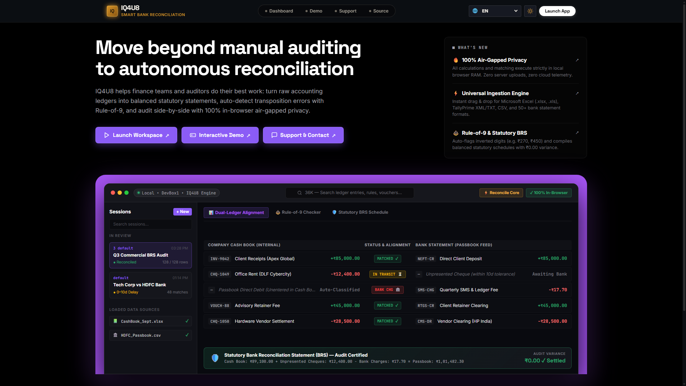
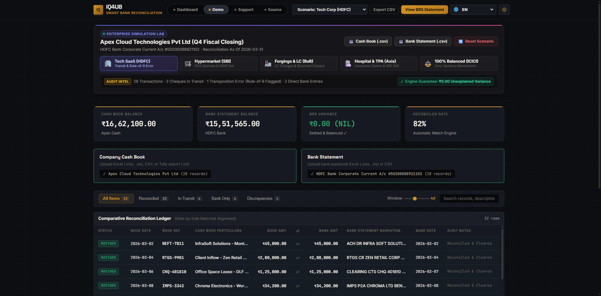
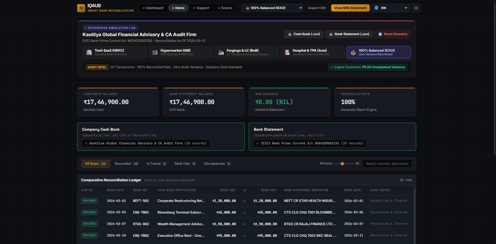
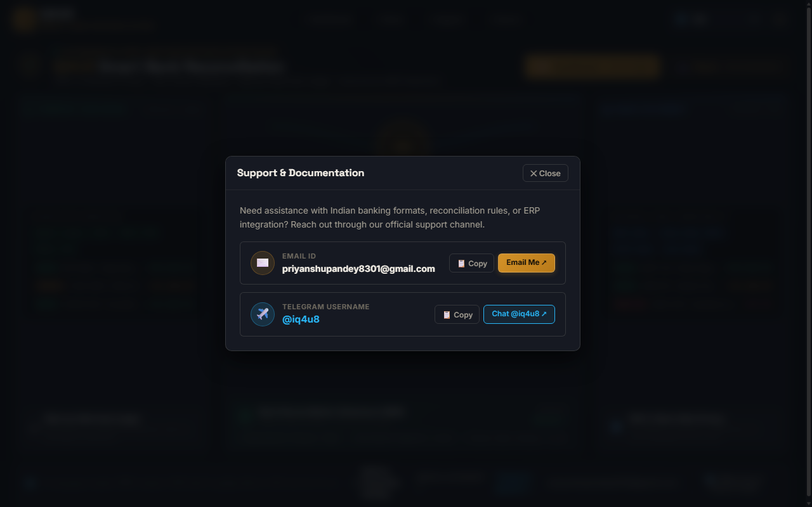
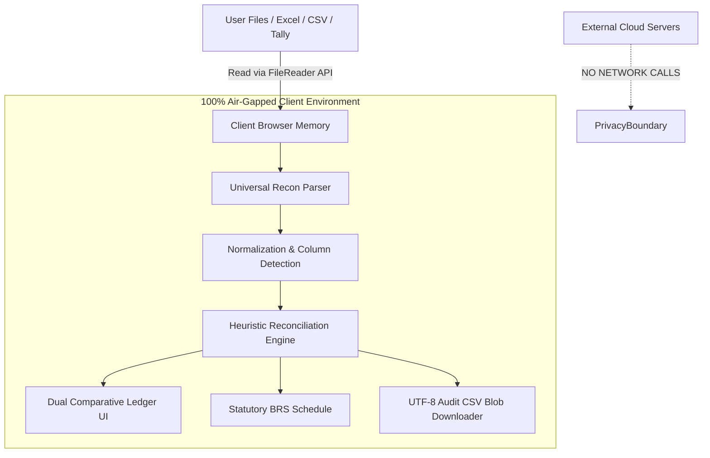

<div align="center">

# ⚡ IQ4U8 SmartRecon
### Autonomous Bank Reconciliation & Comparative Financial Audit Engine

[](https://vercel.com/new/clone?repository-url=https://github.com/iq4u8/smart-recon)
[](LICENSE)
[](#-zero-knowledge-privacy-architecture)
[](#-technology-stack)
[](#-multi-language-localization)
[](#-performance--benchmarks)

**A high-craft, client-side autonomous reconciliation platform built for chartered accountants, CFOs, auditors, and financial teams.**  
Eliminates manual Excel VLOOKUP workflows, flags human transposition errors via the Rule-of-9, and generates statutory ICAI-compliant Bank Reconciliation Statements (BRS) with zero server transmission.

[🚀 Live Demo](https://iqsmartrecon.vercel.app/) · [📖 Documentation](#-key-capabilities) · [🛠️ Quickstart](#-quickstart--deployment) · [👤 Author](#-author--connect)

---

</div>

## 📸 Visual Product Tour

### 1. High-Impact Developer & Auditor Landing Interface
Modern two-column hero with live ecosystem compatibility (Microsoft Excel, TallyPrime, HDFC, SBI, ICICI, Axis, Kotak).


### 2. Interactive Enterprise Simulation Lab & Dual Ledger
Instant scenario switching across 5 authentic corporate banking environments with real-time KPI metrics.


### 3. Aligned Comparative Reconciliation Ledger
Side-by-side transaction reconciliation with clearing window tolerances, direction tracking, and audit trail notes.


### 4. Official Statutory Bank Reconciliation Statement (BRS)
One-click printable and PDF-ready statutory schedule adhering strictly to double-entry accounting principles.


---

## 🎯 The Problem & The Solution

| The Traditional Way (Excel / VLOOKUP) | The IQ4U8 SmartRecon Way |
|---|---|
| **Time Sink**: Finance teams spend 8–15 hours every month manually matching bank statements against company general ledgers. | **Autonomous & Instant**: Multi-pass heuristic engine reconciles thousands of transactions in under 50 milliseconds. |
| **Human Error Prone**: Transposition errors (e.g. ₹24,500 recorded as ₹25,400) slip past standard VLOOKUP formulas. | **Algorithmic Rule-of-9**: Automatically detects digit reversals, calculates variances, and suggests corrective journal entries. |
| **Severe Privacy Liabilities**: Uploading confidential company bank statements to cloud servers violates corporate data compliance. | **100% Air-Gapped**: Zero server data transmission. Works entirely client-side in browser memory with zero telemetry. |
| **Fragile Formatting**: Different date formats (`DD-MM-YYYY`, `MM/DD/YYYY`) and dirty bank narrations break macros. | **Universal Heuristic Ingestion**: Auto-detects column headers, fuzzy matches reference numbers, and cleans raw passbook text. |

---

## 🚀 Key Capabilities

### 1. Multi-Pass Heuristic Matching Engine
The engine evaluates transactions through an intelligent 5-stage cascade:
- **Pass 1 (Exact Match)**: Matches normalized instrument references (`NEFT`, `RTGS`, `CTS Cheque #`, `IMPS`, `UPI`) with identical amounts within an adjustable date tolerance window (1 to 14 days).
- **Pass 2 (Transposition & Discrepancy Isolation)**: Discovers reference matches with minor amount mismatches and tests for the Rule-of-9 mathematical condition `(|diff| % 9 === 0)`.
- **Pass 3 (Unreferenced Amount & Proximity Matching)**: Resolves counterparty inflows and outflows that share exact values and tight clearance dates.
- **Pass 4 (Timing Differences Isolation)**: Classifies unpresented cheques issued to vendors and uncredited customer deposits in transit.
- **Pass 5 (Bank Direct Entries Extraction)**: Isolates direct bank debits (charges, interest, EMI standing instructions) and inward direct remittances not yet entered into the Cash Book.

### 2. Enterprise Simulation Lab (5 Authentic Commercial Presets)
Includes pre-loaded, mathematically audited corporate scenarios:
- 🏢 **Apex Cloud Technologies Pvt Ltd (`techCorp`) · HDFC Bank**: Q4 SaaS closing with transit cheques, cloud subscriptions, and a Rule-of-9 transposition error auto-settled to ₹0.00 variance.
- 🛒 **SmartBazaar Hypermarket Retail Ltd (`retailMart`) · SBI Bank**: FMCG supermarket chain with daily consolidated POS card swipe settlements, supplier CTS cheques, and EDC terminal rental fees.
- 🏭 **Bharat Precision Forgings Ltd (`manufacturing`) · Bank of Baroda**: Heavy B2B industrial engineering with Inland Letters of Credit (LC), vendor RTGS, and customer cheque returns.
- 🏥 **MedLife Multi-Specialty Hospital (`healthcare`) · Axis Bank**: Healthcare institution with inward cashless insurance TPA claims, Siemens 3T MRI lease auto-EMI, and bio-hazard levies.
- ⚖️ **Kautilya Global Financial Advisory (`perfectRecon`) · ICICI Bank**: 100% matched, zero timing difference statutory benchmark.

### 3. Universal Multi-Format Data Ingestion
- **Spreadsheets**: Microsoft Excel (`.xlsx`, `.xls`), OpenDocument spreadsheets.
- **Text & Delimited**: Standard CSV, TSV, and pipe-separated exports.
- **Accounting Software**: Direct `.txt` exports from **TallyPrime**, Tally ERP 9, Busy, Zoho Books, and SAP.
- **Clipboard Instant Paste**: Paste tab-delimited rows directly from Excel or Google Sheets.

### 4. CA-Grade Statutory Statement & CSV Export
- **Formal BRS Schedule**: Generates full ICAI double-entry schedules starting from General Ledger Closing Balance to Bank Passbook Balance with official verification stamps.
- **Safe UTF-8 CSV Export**: Downloads complete side-by-side audit ledgers with UTF-8 BOM (`\uFEFF`) and CSV Formula Injection protection (`=`, `+`, `-`, `@`).
- **Zero Truncation Guarantee**: Uses FileSaver.js and memory retention to guarantee files download with proper `.csv` extensions without UUID fallbacks.

### 5. 🌐 Multi-Language Localization
Single-click translation across 14 global and Indic business languages:
`English` · `हिन्दी (Hindi)` · `Hinglish` · `ગુજરાતી (Gujarati)` · `मराठी (Marathi)` · `தமிழ் (Tamil)` · `বাংলা (Bengali)` · `తెలుగు (Telugu)` · `Deutsch (German)` · `Español (Spanish)` · `Français (French)` · `日本語 (Japanese)` · `العربية (Arabic)` · `中文 (Chinese)`.

---

## 🔒 Zero-Knowledge Privacy Architecture



> **Security Guarantee**: All parsing, heuristics, calculations, and downloads execute **100% locally in the browser**. No credentials, bank account numbers, transaction descriptions, or financial statements ever leave the host device.

---

## 💻 Technology Stack

- **Core Logic**: Modern ES6+ JavaScript (Modular object-oriented heuristic algorithms).
- **Styling**: Pure Vanilla CSS Design System with CSS variables, Glassmorphism, and hardware-accelerated 3D perspective tilt.
- **File Processing**: [SheetJS (xlsx.full.min.js)](https://github.com/sheetjs/sheetjs) for binary Excel parsing.
- **File Export**: [FileSaver.js](https://github.com/eligrey/FileSaver.js) for resilient cross-browser client-side blob downloads.
- **Deployment**: [Vercel](https://vercel.com) (Static Edge CDN, 0ms cold start).

---

## ⚡ Quickstart & Deployment

### Run Locally in 5 Seconds
No dependencies or node build steps required:
```bash
# Clone the repository
git clone https://github.com/iq4u8/smart-recon.git

# Navigate into the project folder
cd smart-recon

# Start any local HTTP server (e.g. Python, Node, or VS Code Live Server)
python -m http.server 3000

# Open in your browser
http://localhost:3000
```

### Deploy to Vercel
The repository includes a ready-to-deploy [`vercel.json`](vercel.json):
1. Fork or import this repository into your [Vercel Dashboard](https://vercel.com/new).
2. Framework Preset: **Other** (Root directory: `./`).
3. Click **Deploy** — your autonomous reconciliation suite goes live instantly on your custom domain!

---

## 📂 Project Architecture

```
smart-recon/
├── index.html            # Main SPA structure, high-impact landing & workspace
├── vercel.json           # Vercel static routing & security headers config
├── LICENSE               # MIT License
├── README.md             # Architecture documentation & portfolio showcase
├── assets/               # High-resolution documentation screenshots
│   ├── hero_landing.png
│   ├── demo_cockpit.png
│   ├── comparative_ledger.png
│   └── brs_statement.png
├── css/
│   ├── tokens.css        # Color tokens, typography, shadows, dark/light theme
│   ├── layout.css        # Grid layouts, responsive flex rules, macOS mockups
│   └── components.css    # Interactive buttons, chips, tables, BRS modals
└── js/
    ├── parser.js         # Universal Excel, CSV, TSV & Tally text parser
    ├── engine.js         # 5-pass heuristic reconciliation & Rule-of-9 logic
    ├── sampleData.js     # 5 authentic Indian enterprise banking presets
    ├── export.js         # CA-compliant statutory BRS & safe CSV downloader
    ├── i18n.js           # 14-language localization dictionary & engine
    └── app.js            # Master state coordinator, UI bindings, and events
```

---

## 👤 Author & Connect

**Priyanshu Pandey (IQ4U8)**  
*Fintech Engineer & Full-Stack Developer*

- 🌐 **Website**: [iq4u8.shop](https://iq4u8.shop)
- 🐙 **GitHub**: [@iq4u8](https://github.com/iq4u8)
- 💬 **Telegram**: [@iq4u8](https://t.me/iq4u8)
- 📧 **Email**: [priyanshupandey8301@gmail.com](mailto:priyanshupandey8301@gmail.com)

---

## 📜 License

This project is licensed under the [MIT License](LICENSE) — free to use, modify, and distribute for both commercial and personal accounting applications.
